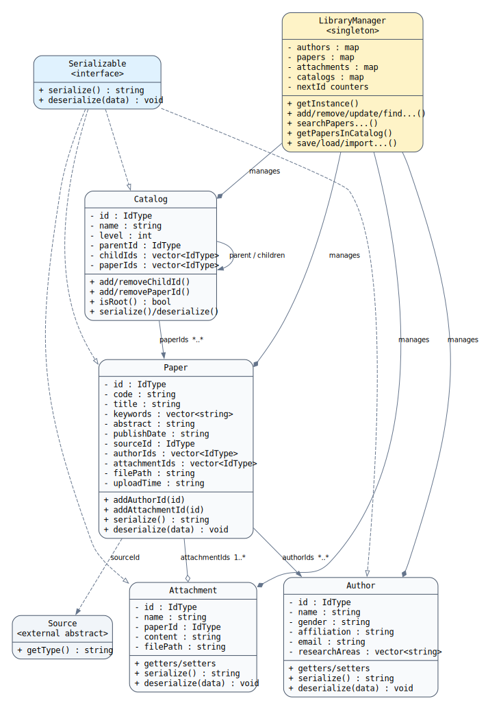

# 周生斌《简易科研文献管理系统》实践报告——详细设计说明

> 本节依据最终源代码编写，重点对应本人在实施计划书中的个人任务：`Author`、`Paper`、`Attachment`、`Catalog` 类的设计与实现，以及 `LibraryManager` 中与这些对象相关的增删改查、关联维护、目录归类、条件检索、数据导入和持久化功能。

## 4 详细设计说明

### 4.1 类设计

#### 4.1.1 Serializable 序列化接口类

`Serializable` 是系统实体对象的统一序列化接口，声明了纯虚函数 `serialize()` 和 `deserialize()`，并提供虚析构函数。`Author`、`Paper`、`Attachment`、`Catalog` 等实体类均继承该接口，从而保证不同类型的对象具有一致的数据保存和读取方式。

该设计体现了面向对象中的抽象与多态思想。上层持久化模块不需要了解每个实体的全部内部结构，只需调用对象公开的序列化接口，即可将对象转换为文本记录；加载数据时，再由相应对象执行反序列化并恢复属性。

#### 4.1.2 Author 作者类

`Author` 类用于保存科研文献作者的信息，主要属性包括作者编号、姓名、性别、工作单位、电子邮箱和研究领域集合。编号属性用于在系统内部唯一标识作者，研究领域使用 `vector<string>` 保存，可以记录一个作者的多个研究方向。

该类通过私有数据成员封装作者信息，并通过 getter、setter 方法对外提供受控访问。`serialize()` 将作者属性转换为一行文本，`deserialize()` 根据字段分隔符恢复对象。多个研究领域在单个字段内使用分号连接。

主要成员如下：

| 类别 | 成员 | 说明 |
|---|---|---|
| 属性 | `m_id` | 作者唯一编号 |
| 属性 | `m_name` | 作者姓名 |
| 属性 | `m_gender` | 性别 |
| 属性 | `m_affiliation` | 工作单位 |
| 属性 | `m_email` | 电子邮箱 |
| 属性 | `m_researchAreas` | 研究领域集合 |
| 方法 | `serialize()` | 将作者对象序列化为文本 |
| 方法 | `deserialize()` | 从文本恢复作者对象 |

#### 4.1.3 Paper 文献类

`Paper` 是系统的核心业务实体，用于表示一篇科研文献。该类除保存 DOI 编号、标题、关键词、摘要、发表日期、刊期、刊号和页码等基本信息外，还通过编号集合建立与作者、附件及出版物来源之间的关联。

文献与作者之间是多对多关系，因此使用 `m_authorIds` 保存作者编号集合；一篇文献可以包含多个笔记或附件，因此使用 `m_attachmentIds` 保存附件编号集合；文献通过 `m_sourceId` 关联一个期刊或会议来源。采用编号关联而不是直接嵌套完整对象，可以避免对象重复保存，并便于统一管理和导入时重新映射编号。

为支持本地全文管理，类中还包含全文路径、上传时间和备注字段。最终版本的 `deserialize()` 同时兼容新旧两种文献记录格式：新格式包含全文路径、上传时间和备注，旧格式缺少部分字段时仍能完成读取。

#### 4.1.4 Attachment 附件类

`Attachment` 类表示与某篇文献关联的笔记或附件，主要保存附件编号、附件名称、所属文献编号、内容说明和实际文件路径。

附件通过 `m_paperId` 指向所属文献。新增附件时，`LibraryManager` 会把新附件编号同步加入对应 `Paper` 对象的附件编号集合；删除附件时，也会从文献对象中移除该编号，从而保持双向关联的一致性。

#### 4.1.5 Catalog 文献目录类

`Catalog` 类用于构建层次化的文献分类目录。每个目录保存自身编号、名称、层级、说明、父目录编号、子目录编号集合和文献编号集合。

当 `m_parentId` 为 `INVALID_ID` 时，该目录为根目录；否则为某个目录的子目录。`m_childIds` 描述目录树结构，`m_paperIds` 描述目录与文献的归类关系。目录对象只记录编号关系，具体文献对象由 `LibraryManager` 统一查找，从而实现目录结构与实体数据的分离。

#### 4.1.6 LibraryManager 核心管理类

`LibraryManager` 采用单例模式，系统运行期间只创建一个管理对象。构造函数私有化，复制构造函数和赋值运算符被删除，外部通过 `getInstance()` 获取唯一实例。

管理器分别使用 `map<IdType, T>` 保存作者、文献、附件和目录对象，并维护各类对象的下一个可用编号。新增对象时由 `generateNextId()` 分配唯一编号，避免界面层自行管理编号。除基本的增删改查外，该类还负责对象关联清理、目录递归查询、条件检索、数据保存、加载和合并导入。

**图 4-1 周生斌负责模块 UML 类图**

### 4.2 算法实现

#### 4.2.1 实体对象序列化与反序列化算法

系统采用文本文件保存数据。实体对象中的不同字段使用 ASCII 控制字符 `0x1E` 作为字段分隔符，字符串集合和编号集合在字段内部使用分号分隔。选择不常出现在普通文本中的控制字符作为主分隔符，可以减少标题、摘要等自然语言内容与分隔符冲突的概率。

序列化过程如下：

1. 按固定顺序读取对象属性。
2. 普通属性直接写入字符串流。
3. `vector<string>` 通过 `join()` 合并，`vector<IdType>` 通过 `joinIds()` 合并。
4. 各字段之间写入 `FIELD_SEP`。
5. 返回生成的一行文本。

反序列化过程与之相反：先使用 `split()` 拆分字段，再通过 `stoi()`、`stod()` 等函数恢复数值属性，并使用 `splitIds()` 恢复编号集合。`Paper::deserialize()` 还根据字段数量判断记录版本，使旧数据仍可被新版本程序读取。

#### 4.2.2 对象增删改查与关联一致性维护算法

新增对象时，管理器先生成编号，再复制传入对象并设置编号，最后写入对应的 `map`。查询对象时利用 `map::find()` 按编号定位，查找成功返回对象指针，失败返回空指针。

删除对象不能只删除当前记录，还必须维护关联关系：

- 删除作者时，遍历全部文献并从 `authorIds` 中移除该作者编号，同时从作者目录中移除该编号。
- 新增附件时，除保存附件对象外，还将附件编号加入所属文献的 `attachmentIds`。
- 删除附件时，从所属文献的附件编号集合中同步删除该编号。
- 删除文献时，删除其附件记录，并遍历全部文献目录，移除目录中保存的该文献编号。

集合删除主要使用“查找/删除”和“erase-remove”方式完成。通过在管理器内部集中维护关系，避免界面层直接修改多个对象造成数据不一致。

#### 4.2.3 文献目录树维护算法

新增目录时，算法先判断父目录编号：

- 若父目录编号无效，则将目录层级设为 0，作为根目录保存。
- 若父目录存在，则将新目录层级设为“父目录层级 + 1”，并把新目录编号加入父目录的 `childIds`。

删除目录时，不直接递归删除其子目录，而是将子目录提升一级。算法先从父目录的子目录集合中移除待删除目录，再遍历其全部子目录，将子目录的父编号改为待删除目录的父编号，并相应减少层级；若存在上一级目录，则把这些子目录重新加入上一级目录的子目录集合。这样可以避免删除一个目录时误删整个目录树和其中的文献对象。

#### 4.2.4 目录内文献递归查询算法

`getPapersInCatalog()` 使用深度优先搜索遍历目录树。辅助函数 `collectPapersRecursive()` 先读取当前目录中的文献编号，再递归访问全部子目录。

算法步骤如下：

1. 根据目录编号查找当前目录，不存在则结束本次递归。
2. 遍历当前目录的 `paperIds`。
3. 使用 `visited` 记录已经加入结果集的文献编号，防止同一文献因被多个目录引用而重复出现。
4. 根据文献编号从文献容器中查找对象并加入结果。
5. 遍历 `childIds`，对每个子目录递归执行相同过程。

设目录数为 \(C\)，被访问的文献关联数为 \(R\)，该算法的时间复杂度约为 \(O(C+R)\)，能够满足本项目规模下的目录查询需求。

#### 4.2.5 文献多条件检索算法

系统实现了按标题、作者和关键词检索文献：

- 标题检索：遍历文献集合，使用 `string::find()` 判断标题是否包含查询字符串。
- 作者检索：遍历文献的作者编号集合，判断目标作者编号是否存在。
- 关键词检索：逐项检查文献关键词，只要任意关键词包含查询字符串就加入结果，并立即结束当前文献的关键词循环。
- 作者姓名检索：先在作者表中查找姓名匹配的作者编号，再调用按作者编号检索文献的方法。

该实现复用了已有查询函数，减少重复代码。对于当前教学项目的数据规模，线性遍历具有结构直观、易于验证的优点。

#### 4.2.6 数据合并导入与编号重映射算法

导入外部数据时，不能直接使用外部文件中的原编号，否则可能与当前文献库编号冲突。系统因此采用“旧编号—新编号映射”算法。

首先把外部作者、文献、附件和目录读取到临时容器。随后按依赖顺序执行：

1. 导入作者，建立 `authorIdMap`。
2. 导入文献，将原作者编号替换为新作者编号，并清空旧附件编号，建立 `paperIdMap`。
3. 导入附件，根据 `paperIdMap` 替换所属文献编号。
4. 导入目录，根据 `paperIdMap` 替换目录中的文献编号。
5. 对目录使用待处理集合，只有当父目录已经完成映射时才导入当前目录。
6. 若出现父目录缺失或循环引用，无法继续减少待处理集合，则把剩余目录作为根目录导入，保证有效数据尽可能保留。

该算法既避免编号冲突，又保持作者—文献—附件—目录之间的关联关系。

#### 4.2.7 数据持久化算法

系统支持两种保存形式：单文件分区保存和按目录拆分保存。单文件模式使用 `[AUTHORS]`、`[PAPERS]`、`[ATTACHMENTS]`、`[CATALOGS]` 等标记区分数据类型；目录模式分别保存为 `authors.txt`、`papers.txt`、`attachments.txt`、`catalogs.txt` 等文件。

加载时先清空当前容器，再逐行读取文本并调用对应对象的 `deserialize()`。每加载一个对象，均根据其编号更新下一个可用编号，保证后续新增对象不会与已加载对象冲突。程序关闭时自动保存默认数据，同时保留单文件备份，提高了数据恢复能力。

### 4.3 本人负责模块的面向对象特点

本人负责部分主要体现了以下面向对象思想：

1. **封装**：实体属性设为私有成员，通过公开方法访问和修改。
2. **抽象**：所有实体统一实现 `Serializable` 接口。
3. **多态**：持久化模块通过统一接口处理不同实体对象。
4. **组合与关联**：文献通过编号集合关联作者和附件，目录通过编号集合组织文献。
5. **单一管理入口**：`LibraryManager` 集中管理对象生命周期和关联一致性，降低界面层与数据层之间的耦合。

