## 5 调试与测试

### 5.1 系统启动与数据文件测试

首次启动系统时，程序能够正常显示主窗口。界面左侧为文献库、作者库和出版物库导航区，中间为数据列表区，上方提供新增、编辑、删除和搜索等操作入口。初始状态下数据列表为空，说明系统能够在无历史数据的情况下正常启动。通过“文件”菜单可以执行保存、加载和导入数据操作。其中，“加载”用于使用所选文件替换当前文献库，“导入数据”用于将外部数据合并到当前文献库。测试结果表明，系统启动及数据文件操作均能正常完成，重新加载后各类对象及其关联信息能够正确恢复。

<table>
  <tr>
    <td width="50%" align="center">
      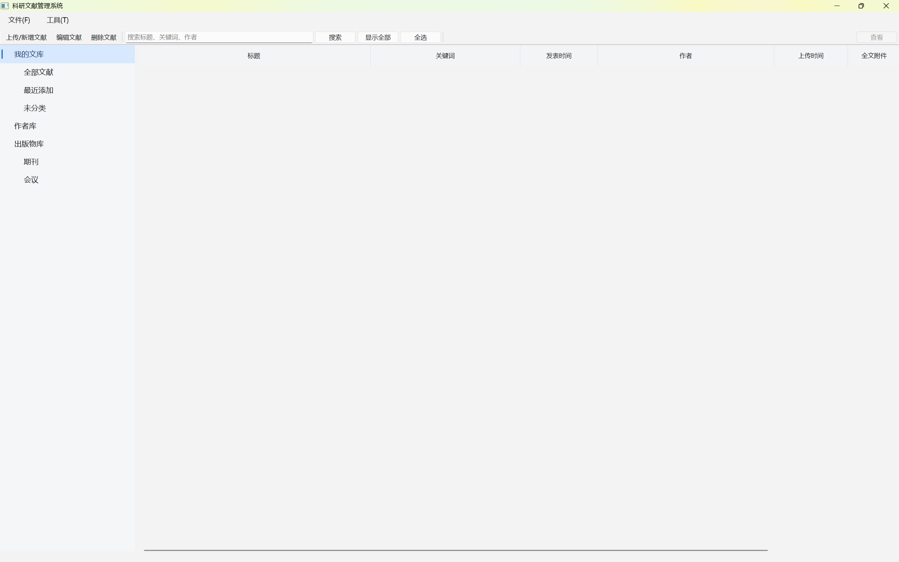 
      图 5-1 系统初次使用界面
    </td>
    <td width="50%" align="center">
      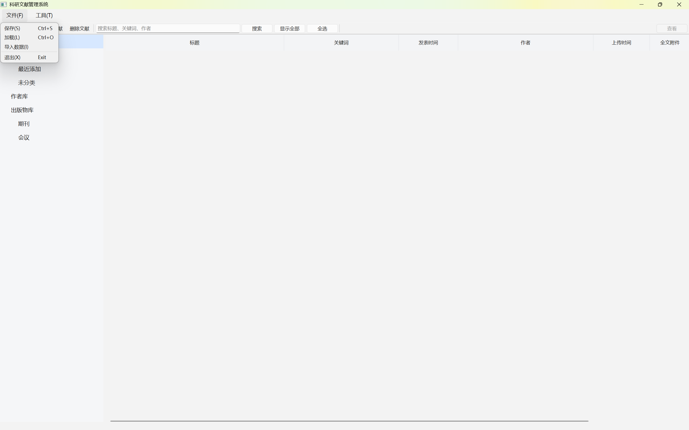 
      图 5-2 数据保存、加载与导入操作
    </td>
  </tr>
</table>

### 5.2 文献管理功能测试

#### 5.2.1 文献新增与元数据识别测试

点击“上传/新增文献”按钮后，系统弹出文献编辑对话框。用户可以填写 DOI 编号、标题、关键词、摘要、发表时间、刊期、刊号、页码和备注，也可以选择本地全文文件。对话框还提供“作者与出版物”和“附件”选项卡，用于建立文献与其他对象之间的关联。

选择 PDF 全文文件后，系统会尝试从 PDF 中提取标题、作者、关键词、摘要、发表日期、DOI 或 arXiv 编号等信息，并在导入预览窗口中显示各字段的数据来源和可信度。用户可以检查、修改识别结果，再决定是否填入文献表单。

<table>
  <tr>
    <td width="50%" align="center">
      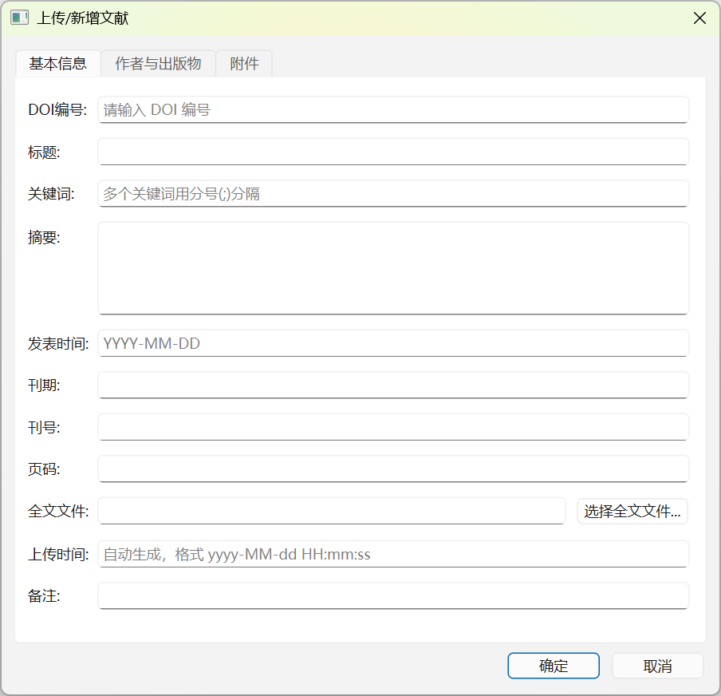 
      图 5-3 新增文献操作
    </td>
    <td width="50%" align="center">
      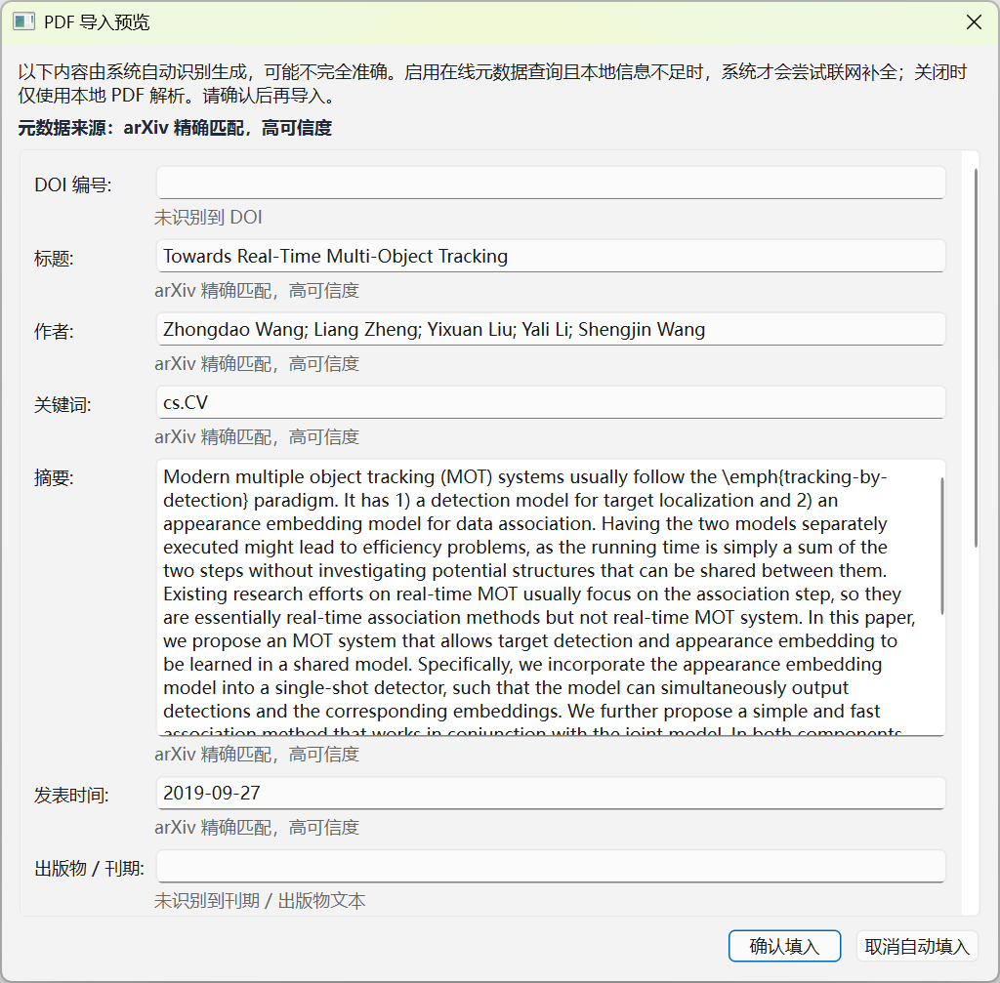 
      图 5-4 PDF 元数据识别预览
    </td>
  </tr>
</table>

测试中输入文献基本信息并确认后，文献能够正确加入列表；上传时间能够自动生成，关键词能够按照分号拆分保存，全文路径也能够正确记录。使用包含 arXiv 信息的 PDF 文件进行识别时，系统能够获得文献标题、作者、摘要和发表日期，并给出高可信度的数据来源提示，说明本地识别与在线补全流程可以正常工作。

#### 5.2.2 文献查询与详情查看测试

文献列表支持按标题、关键词和作者进行搜索，并能够显示全部文献、最近添加文献、未分类文献以及指定目录下的文献。选中文献后点击“查看”按钮，右侧会显示完整标题、作者、出版物、发表时间、上传时间和关键词等详细信息。

详情区域还提供“打开全文”“上传笔记”和“打开笔记”等功能。测试结果表明，文献详情能够与当前选择同步更新，存在有效文件路径时可以调用系统默认程序打开全文或笔记文件。

  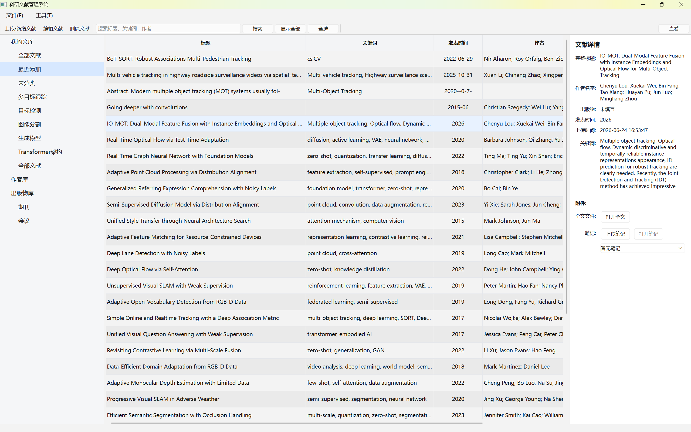

图 5-5 文献列表与详情查看

### 5.3 作者管理功能测试

#### 5.3.1 作者列表与查询测试

进入作者库后，系统以表格形式显示作者姓名、性别、单位、邮箱和研究领域，搜索框能够根据上述字段过滤作者记录，新增、编辑和删除按钮会自动切换为作者管理操作。选中作者并点击“查看”后，右侧详情区域可以显示作者基本信息、研究领域以及该作者关联的文献。测试表明，作者列表显示、条件查询和作者—文献关联解析均能正常工作。

<table>
  <tr>
    <td width="50%" align="center">
      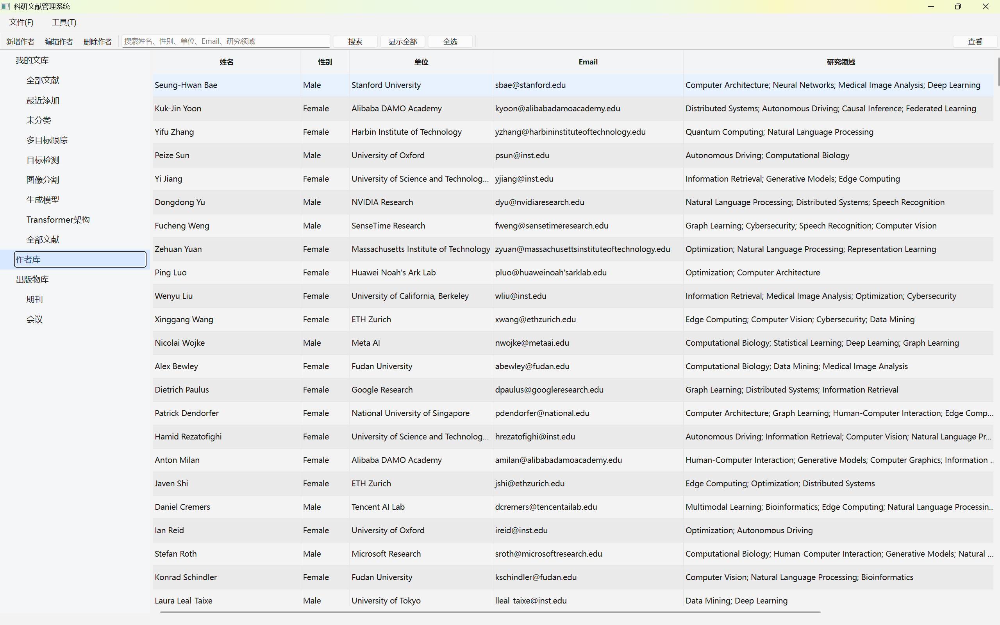 
      图 5-6 作者库界面
    </td>
    <td width="50%" align="center">
      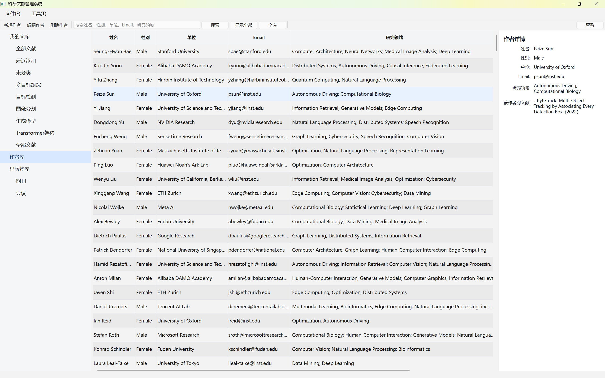 
      图 5-7 作者详情查看
    </td>
  </tr>
</table>

#### 5.3.2 作者新增与编辑测试

作者新增和编辑功能使用相同的数据输入结构。新增作者时可以填写姓名、性别、单位、邮箱及多个研究领域；编辑作者时，系统会先加载原有数据，修改后仍保留原作者编号。

<table>
  <tr>
    <td align="center">
      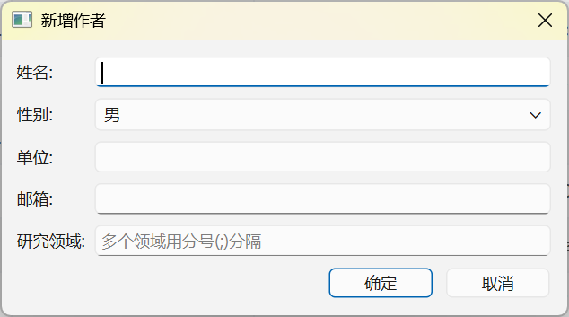 
      图 5-8 新增作者
    </td>
    <td align="center">
      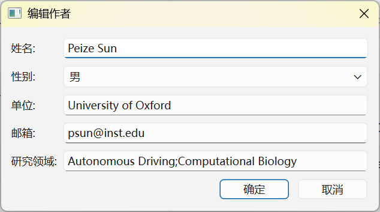 
      图 5-9 编辑作者
    </td>
  </tr>
</table>

测试结果表明，姓名为空时系统不会提交数据；输入有效信息后可以正常新增作者。编辑已有作者后，列表和详情区域能够同步显示修改后的内容。

### 5.4 分类目录功能测试

系统支持创建多级文献目录。在文献库或已有目录上打开右键菜单，可以新增根目录或子目录，也可以删除用户创建的目录。选择某个目录时，中间区域显示该目录及其子目录中的文献。

  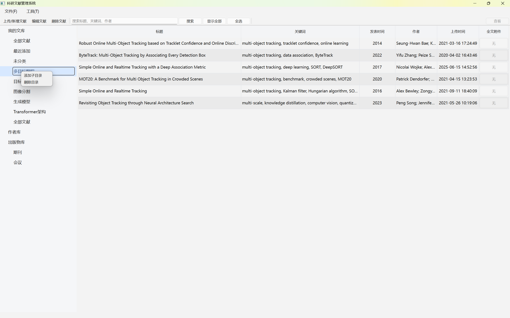

图 5-10 文献目录创建与管理

测试中分别创建了“多目标跟踪”“目标检测”“图像分割”“生成模型”和“Transformer 架构”等目录。目录能够正确显示在左侧树形结构中，文献可以归入指定目录；删除目录时不会删除文献实体，子目录能够按照程序设计调整到上一级。

### 5.5 出版物管理功能测试

出版物库能够统一管理期刊和会议两种出版物来源。选择“出版物库”时，系统同时显示两种来源的编号、类型、简称、全名、领域、出版单位、检索类型及扩展信息。

  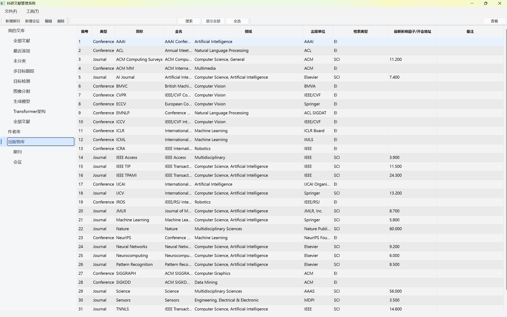

图 5-11 出版物库综合列表

选择“会议”分类后，界面显示会议简称、全名、研究领域、开会地址、出版单位和检索类型；选择“期刊”分类后，界面显示期刊简称、全名、研究领域、出版单位、检索类型和最新影响因子。测试结果验证了 `Conference` 类的会议地址属性和 `Journal` 类的影响因子属性均能够正确保存、分类和显示。

<table>
  <tr>
    <td width="50%" align="center">
      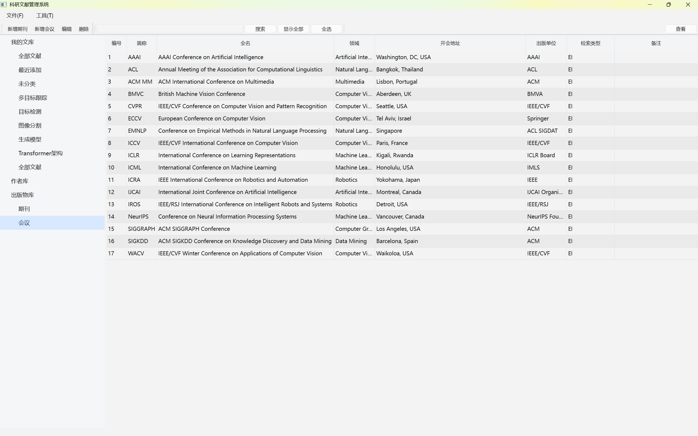 
      图 5-12 会议出版物列表
    </td>
    <td width="50%" align="center">
      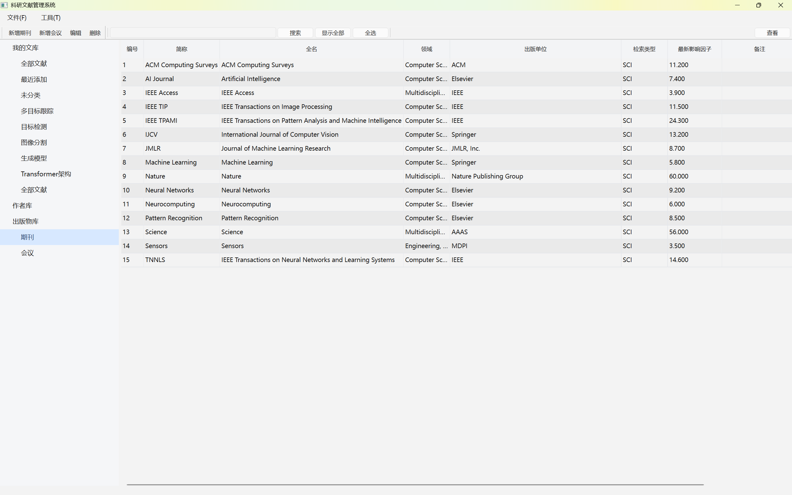 
      图 5-13 期刊出版物列表
    </td>
  </tr>
</table>

### 5.6 测试结果汇总

| 测试项目 | 预期结果 | 实际结果 |
|---|---|---|
| 系统启动 | 主窗口和导航区域正常显示 | 通过 |
| 数据保存、加载与导入 | 数据及对象关联能够正确恢复或合并 | 通过 |
| 文献新增与编辑 | 文献信息能够正确保存并显示 | 通过 |
| PDF 元数据识别 | 能够提取或在线补全文献信息 | 通过 |
| 文献搜索与详情查看 | 能够筛选文献并显示详细信息 | 通过 |
| 全文与笔记管理 | 能够保存文件路径并打开有效文件 | 通过 |
| 作者新增、编辑与删除 | 作者信息和关联关系能够同步更新 | 通过 |
| 作者详情查看 | 能够显示作者信息及其关联文献 | 通过 |
| 文献目录管理 | 能够创建多级目录并完成文献归类 | 通过 |
| 期刊与会议管理 | 两种来源及其特有属性能够正确显示 | 通过 |

通过上述测试，系统各主要模块均能按照设计要求正常运行。测试过程中发现的界面刷新、文件路径处理、对象关联和数据加载问题已经完成调试，最终程序运行稳定，能够满足简易科研文献管理系统的基本使用需求。
