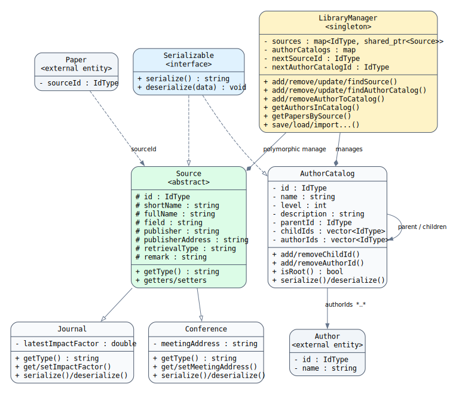

# 邵一景《简易科研文献管理系统》实践报告——详细设计说明

> 本节依据最终源代码编写，重点对应本人在实施计划书中的个人任务：`Source`、`Journal`、`Conference`、`AuthorCatalog` 类的设计与实现，以及 `LibraryManager` 中出版物来源管理、作者归类、按来源查询、数据导入和持久化等功能。

## 4 详细设计说明

### 4.1 类设计

#### 4.1.1 Source 出版物来源抽象基类

`Source` 用于抽象期刊和会议共有的出版物来源信息。该类继承 `Serializable` 接口，并把来源编号、简称、全称、所属领域、出版单位、出版单位地址、检索类型和备注等公共属性定义为受保护成员，使子类能够直接复用这些数据。

`Source` 声明纯虚函数 `getType()`，因此不能直接创建对象，只能通过具体子类表示实际出版物。该设计把期刊和会议的公共特征集中到基类中，避免重复定义属性和访问方法，同时允许管理器使用 `Source` 指针统一保存和操作不同来源对象。

#### 4.1.2 Journal 期刊类

`Journal` 公有继承 `Source`，在公共来源信息基础上增加 `m_latestImpactFactor`，用于保存期刊的最新影响因子。`getType()` 返回 `"Journal"`，作为运行时类型标识和持久化类型标识。

`serialize()` 先按固定顺序写入继承自 `Source` 的公共属性，再写入影响因子；`deserialize()` 使用 `stod()` 恢复影响因子。构造函数将影响因子初始化为 0，避免未赋值时出现不确定数据。

#### 4.1.3 Conference 会议类

`Conference` 同样公有继承 `Source`，在公共属性基础上增加 `m_meetingAddress`，用于记录会议举办地点。`getType()` 返回 `"Conference"`。

期刊和会议具有相同的公共接口，但各自保留不同的扩展属性。界面和管理器可以通过基类指针调用公共方法，在需要显示具体属性时再使用运行时类型判断访问影响因子或会议地址，体现了继承和运行时多态。

#### 4.1.4 AuthorCatalog 作者目录类

`AuthorCatalog` 用于对作者进行层次化分类。类中包含目录编号、目录名称、层级、说明、父目录编号、子目录编号集合和作者编号集合。

当父目录编号为 `INVALID_ID` 时，该目录为根目录。`addChildId()` 和 `addAuthorId()` 在添加前进行重复检查，防止同一子目录或作者在一个作者目录中被重复记录；删除作者编号时采用 `remove()` 与 `erase()` 组合，可以删除集合中全部相同编号。

作者目录本身不保存完整作者对象，而是保存作者编号，由 `LibraryManager` 统一查找作者实体。这种设计降低了目录结构与作者数据之间的耦合。

#### 4.1.5 LibraryManager 中的来源与作者目录管理

`LibraryManager` 使用 `map<IdType, shared_ptr<Source>>` 保存出版物来源。使用基类智能指针可以在同一容器中同时保存 `Journal` 和 `Conference` 对象，并自动管理对象生命周期。

作者目录使用 `map<IdType, AuthorCatalog>` 保存。管理器负责作者目录编号生成、父子关系维护、作者归类、递归查询以及删除作者时的目录关联清理。

**图 4-1 邵一景负责模块 UML 类图**

### 4.2 算法实现

#### 4.2.1 出版物来源继承与运行时多态算法

系统新增来源时，由界面根据用户选择创建 `Journal` 或 `Conference` 对象，再以 `shared_ptr<Source>` 形式传递给 `LibraryManager`。管理器只通过基类接口设置编号并保存对象，不需要为两种来源编写两套容器和基本管理逻辑。

显示来源类型时调用虚函数 `getType()`，程序根据返回值确定具体类型。若类型为 `Journal`，则访问影响因子；若类型为 `Conference`，则访问会议地址。由于 `Source` 具有虚析构函数，通过基类智能指针释放子类对象时能够正确调用析构过程。

#### 4.2.2 来源对象的多态序列化与反序列化算法

保存来源数据时，系统先写入 `getType()` 返回的类型标识，再写入对象自身的序列化结果，记录格式可表示为：

`类型标识 + FIELD_SEP + 来源对象序列化数据`

加载时先拆分类型标识和剩余字段：

1. 若类型为 `"Journal"`，创建 `shared_ptr<Journal>`。
2. 若类型为 `"Conference"`，创建 `shared_ptr<Conference>`。
3. 调用具体子类的 `deserialize()` 恢复属性。
4. 将子类对象以 `shared_ptr<Source>` 形式存入统一来源容器。

该过程相当于使用简单工厂思想恢复多态对象，解决了仅依靠基类指针无法直接判断应创建何种子类的问题。

#### 4.2.3 出版物来源增删改查与关联维护算法

新增来源时，管理器分配新的来源编号，调用基类公开方法设置编号，并将智能指针写入来源映射表。更新来源时保留原编号，用新创建的具体来源对象替换旧对象。

删除来源时，系统先遍历全部文献。若某篇文献的 `sourceId` 等于待删除来源编号，则将其来源编号设置为 `INVALID_ID`，使文献变为“未关联出版物”状态，然后再删除来源对象。这样可以避免文献保存一个已经不存在的来源编号。

按来源查询文献时，遍历全部文献并比较 `sourceId`，相等则加入结果集合。该算法实现简单，能够满足教学项目的数据规模。

#### 4.2.4 作者目录树构建算法

新增作者目录时，管理器先生成唯一编号。若存在父目录，则把新目录层级设置为父目录层级加 1，并将新目录编号加入父目录的 `childIds`；若没有父目录，则设置为根目录。

更新作者目录时，算法比较原父目录编号和新父目录编号。如果父目录发生变化，先从原父目录中移除当前目录编号，再把当前目录编号加入新父目录，最后重新计算目录层级。该步骤保证目录移动后父子关系仍然正确。

删除作者目录时，算法不会删除目录中的作者实体，也不会递归删除子目录，而是把子目录提升到待删除目录的上一级。这样可以避免因误删分类目录造成作者信息丢失。

#### 4.2.5 作者归类与去重算法

`addAuthorToCatalog()` 在执行前同时检查作者和作者目录是否存在。检查通过后调用 `AuthorCatalog::addAuthorId()` 完成归类。该方法使用 `std::find()` 检查编号是否已经存在，只有不存在时才加入集合。

移除作者时，`LibraryManager::removeAuthor()` 会遍历全部作者目录并调用 `removeAuthorId()`，保证作者删除后目录中不保留无效引用。

#### 4.2.6 作者目录递归查询算法

`getAuthorsInCatalog()` 使用深度优先搜索查询某个作者目录及其全部子目录中的作者。

算法步骤如下：

1. 根据目录编号在作者目录容器中查找当前目录。
2. 遍历当前目录的 `authorIds`。
3. 使用 `visited` 映射记录已经加入结果集的作者编号。
4. 对未访问作者，从作者容器中取得对象并加入结果。
5. 遍历 `childIds`，递归处理每个子目录。

使用访问标记既可以避免作者被多个子目录引用时重复出现，也能降低异常目录关系造成重复遍历的风险。若目录数为 \(C\)，作者关联数为 \(R\)，算法时间复杂度约为 \(O(C+R)\)。

#### 4.2.7 来源和作者目录的导入编号重映射算法

外部数据导入时，原来源编号和作者目录编号可能与当前系统冲突，因此需要建立旧编号到新编号的映射。

来源对象先通过多态反序列化恢复，再调用 `addSource()` 生成新编号，并建立 `sourceIdMap`。导入文献时，原 `sourceId` 会通过该映射替换；若原来源不存在，则设置为 `INVALID_ID`。

作者目录的导入必须保证父目录先于子目录完成。系统先把全部旧目录编号放入待处理集合，每轮只导入父目录已经完成映射的目录。导入时还会利用 `authorIdMap` 替换目录中的作者编号，并清空旧的子目录编号，由 `addAuthorCatalog()` 根据新的父子关系重新建立目录树。

如果一轮处理后待处理集合大小没有变化，说明存在父目录缺失或异常循环关系。此时系统将剩余目录作为根目录导入，从而避免整个导入过程陷入死循环。

#### 4.2.8 文件保存与加载算法

来源数据保存时保留具体类型标识，作者目录保存父编号、子编号和作者编号集合。加载过程中，每恢复一个来源或作者目录对象，都根据其编号更新相应的下一个可用编号。

系统既支持单个文本文件的分区保存，也支持在 `sources/sources.txt` 和 `author_catalogs/author_catalogs.txt` 等独立文件中分类保存。分类存储便于检查数据，单文件备份则便于整体导入和恢复。

### 4.3 本人负责模块的面向对象特点

本人负责部分主要体现了以下面向对象思想：

1. **抽象**：`Source` 提取期刊和会议的共同属性与行为。
2. **继承**：`Journal`、`Conference` 复用来源基类的数据和接口。
3. **多态**：系统通过 `Source` 指针统一管理不同来源对象，通过虚函数识别具体类型。
4. **封装**：作者目录和来源对象的数据成员由类内部维护。
5. **智能指针管理**：使用 `shared_ptr<Source>` 保存多态对象，减少手动内存管理风险。
6. **树形组合关系**：`AuthorCatalog` 通过父子编号建立层次化作者分类结构。

